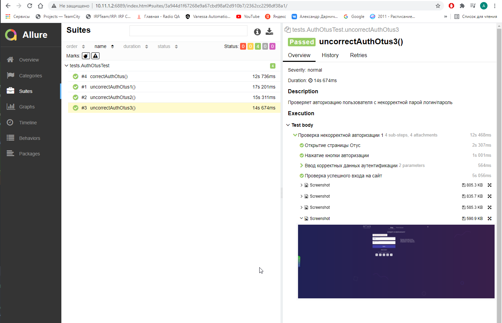

# HW8
**Тема домашней работы:** Отчетность: Allure, Report Portal. Снятие скриншотов и запись видео

**Задание**: 
Добавить интеграцию c системой отчетности к своим тестам

Цель:
Выполнение домашнего задания поможет вам закрепить те знания которые вы получили на вебинаре

Необходимо добавить зависимости в pom файл своих тестов
Добавить аннотации в тестах
Реализовать добавление скриншота в отчет
Приложить ссылку на код своего проекта в git
Приложить скриншот полученного отчета

Проект запускать через терминал по команде:

**mvn clean test allure:serve**

##Скриншот успешного прохождения теста в подключенном Allure:

